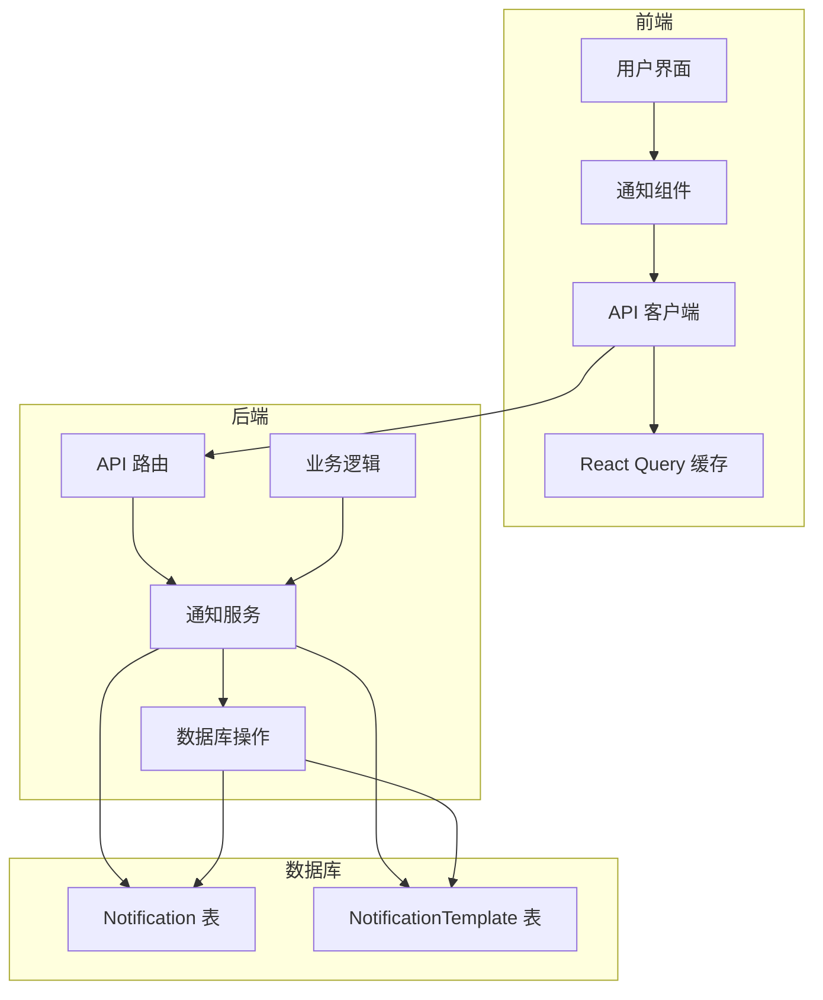

# 系统消息发送机制分析

## 1. 概述

UNISSA 智慧校园平台实现了一套完整的消息通知系统，支持多通道、多类型的消息发送和管理。本文档详细分析系统的消息发送机制、数据流和实现细节。

## 2. 核心架构

### 2.1 数据模型

系统使用以下核心数据模型来管理消息：

#### 通知模板 (`NotificationTemplate`)

| 字段名 | 类型 | 描述 |
|--------|------|------|
| `id` | `String` | 模板唯一标识 |
| `eventKey` | `String` | 事件标识（唯一） |
| `subjectTpl` | `String` | 主题模板（支持变量） |
| `bodyTpl` | `String` | 正文模板（支持变量） |
| `channels` | `String` | 发送通道（JSON 数组） |
| `createdAt` | `DateTime` | 创建时间 |

#### 通知 (`Notification`)

| 字段名 | 类型 | 描述 |
|--------|------|------|
| `id` | `String` | 通知唯一标识 |
| `userId` | `String` | 接收用户ID |
| `user` | `User` | 接收用户关系 |
| `templateId` | `String` | 模板ID（可选） |
| `template` | `NotificationTemplate` | 模板关系（可选） |
| `type` | `String` | 通知类型 |
| `subject` | `String` | 通知主题 |
| `body` | `String` | 通知正文 |
| `status` | `String` | 通知状态（默认：pending） |
| `sentAt` | `DateTime` | 发送时间 |
| `triggeredByEvent` | `String` | 触发事件 |
| `isRead` | `Boolean` | 是否已读（默认：false） |
| `createdAt` | `DateTime` | 创建时间 |

### 2.2 技术架构



## 3. 消息发送流程

### 3.1 通知触发

系统通过事件触发机制发送通知，主要流程如下：

1. **事件产生**：系统中的各种业务操作（如作业提交、成绩发布、审批通过等）产生事件
2. **模板匹配**：根据事件类型匹配对应的通知模板
3. **参数填充**：使用实际数据填充模板中的变量（如 `{{prNumber}}`、`{{applicantName}}` 等）
4. **通知创建**：创建通知记录，设置状态为 `pending`
5. **通道选择**：根据模板配置的通道选择发送方式（如 email、push 等）
6. **消息发送**：通过选定的通道发送消息
7. **状态更新**：更新通知状态为 `sent` 或 `failed`

### 3.2 前端接收与展示

前端通过以下流程处理通知：

1. **定期拉取**：使用 React Query 每 10 秒自动拉取通知列表
2. **缓存管理**：使用 React Query 缓存优化性能
3. **未读计数**：计算并显示未读通知数量
4. **通知展示**：在导航栏显示通知下拉菜单
5. **标记已读**：点击通知时标记为已读
6. **导航跳转**：根据通知类型跳转到相应页面

## 4. 核心功能实现

### 4.1 后端 API 实现

#### 通知路由 (`/backend/src/routes/notifications.ts`)

```typescript
// GET /api/v1/notifications
router.get('/', async (req: AuthRequest, res: Response) => {
  const userId = req.user!.userId
  const notifications = await prisma.notification.findMany({
    where: { userId },
    orderBy: { createdAt: 'desc' },
    take: 20,
  })
  res.json({ success: true, data: notifications })
})

// PATCH /api/v1/notifications/:id/read
router.patch('/:id/read', async (req: AuthRequest, res: Response) => {
  const userId = req.user!.userId
  const notif = await prisma.notification.findFirst({
    where: { id: req.params.id, userId },
  })
  if (!notif) { res.status(404).json({ success: false, message: 'Notification not found' }); return }

  const updated = await prisma.notification.update({
    where: { id: req.params.id },
    data: { isRead: true, sentAt: new Date() },
  })
  res.json({ success: true, data: updated })
})

// PATCH /api/v1/notifications/mark-all-read
router.patch('/mark-all-read', async (req: AuthRequest, res: Response) => {
  const userId = req.user!.userId
  await prisma.notification.updateMany({
    where: { userId, isRead: false },
    data: { isRead: true },
  })
  res.json({ success: true, message: 'All notifications marked as read' })
})
```

### 4.2 前端实现

#### 通知组件 (`/frontend/src/layouts/Navbar.tsx`)

```typescript
const { data: notifications = [] } = useQuery<Notification[]>({
  queryKey: ['notifications'],
  queryFn: async () => {
    try {
      const { data } = await apiClient.get('/notifications')
      return data.data ?? []
    } catch {
      return []
    }
  },
  refetchInterval: 10000,  // 每10秒刷新一次
  refetchOnWindowFocus: true,
})

const unreadCount = notifications.filter(n => !n.isRead).length

const handleNotificationClick = async (notification: Notification) => {
  setNotifOpen(false)
  
  if (!notification.isRead) {
    try {
      await apiClient.patch(`/notifications/${notification.id}/read`)
      qc.invalidateQueries({ queryKey: ['notifications'] })
    } catch (e) {
      console.error('Failed to mark notification as read:', e)
    }
  }

  if (notification.type === 'grade_updated') {
    navigate('/student/transcript')
  } else if (notification.type === 'assignment_submission') {
    navigate('/lms/grading')
  }
}
```

### 4.3 通知模板初始化

系统在启动时通过 `seed.ts` 初始化常用的通知模板：

```typescript
const templates = [
  { eventKey: 'pr_approved_l1', subjectTpl: 'PR {{prNumber}} Approved – Level 1', bodyTpl: 'Your Purchase Request {{prNumber}} has been approved by the Department Head and forwarded to Finance.', channels: '["email","push"]' },
  { eventKey: 'admission_offer_letter', subjectTpl: 'Congratulations – Admission Offer from UNISSA', bodyTpl: 'Dear {{applicantName}}, we are pleased to offer you admission to {{programme}} commencing {{intake}}.', channels: '["email"]' },
  { eventKey: 'grade_released', subjectTpl: '{{courseCode}} – Grade Released', bodyTpl: 'Your grade for {{assignmentTitle}} has been released: {{grade}} ({{marks}}/100).', channels: '["push"]' },
]
for (const t of templates) {
  await prisma.notificationTemplate.upsert({ where: { eventKey: t.eventKey }, create: t, update: {} })
}
```

## 5. 通知类型与通道

### 5.1 通知类型

| 类型 | 描述 | 触发事件 | 处理方式 |
|------|------|----------|----------|
| `grade_updated` | 成绩更新通知 | 成绩发布 | 跳转到成绩单页面 |
| `assignment_submission` | 作业提交通知 | 学生提交作业 | 跳转到评分页面 |
| `pr_approved_l1` | 采购申请一级审批通过 | 部门主管审批通过 | 发送邮件和推送通知 |
| `admission_offer_letter` | 录取通知 | 录取决定 | 发送邮件 |
| `grade_released` | 成绩发布 | 成绩发布 | 发送推送通知 |

### 5.2 通知通道

| 通道 | 描述 | 适用场景 |
|------|------|----------|
| `email` | 电子邮件 | 重要通知，如录取通知、财务提醒 |
| `push` | 系统内推送 | 即时通知，如作业提交、成绩更新 |
| `sms` | 短信通知 | 紧急通知，如系统维护、重要截止日期 |

## 6. 消息发送的技术细节

### 6.1 模板变量替换

系统使用模板变量替换机制，支持在通知模板中使用 `{{variable}}` 格式的变量，如：

- `{{prNumber}}`：采购申请编号
- `{{applicantName}}`：申请人姓名
- `{{programme}}`：专业名称
- `{{intake}}`：入学时间
- `{{courseCode}}`：课程代码
- `{{assignmentTitle}}`：作业标题
- `{{grade}}`：成绩等级
- `{{marks}}`：分数

### 6.2 通知状态管理

通知状态流转：

1. **pending**：通知创建后，待发送状态
2. **sent**：通知成功发送
3. **failed**：通知发送失败
4. **read**：用户已读（通过 `isRead` 字段标记）

### 6.3 性能优化

- **前端缓存**：使用 React Query 缓存通知数据，减少重复请求
- **定期拉取**：每 10 秒自动拉取通知，保证数据实时性
- **批量操作**：支持标记所有通知为已读的批量操作
- **分页查询**：后端限制每次查询 20 条通知，避免数据过多

## 7. 集成点与扩展

### 7.1 与其他模块的集成

| 模块 | 集成点 | 通知类型 |
|------|--------|----------|
| 招生管理 | 录取决定 | `admission_offer_letter` |
| 学习管理系统 | 成绩发布 | `grade_released`、`grade_updated` |
| 学习管理系统 | 作业提交 | `assignment_submission` |
| 采购管理 | 审批流程 | `pr_approved_l1` |
| 财务管理 | 缴费提醒 | `payment_reminder` |
| 人力资源 | 请假审批 | `leave_approved` |

### 7.2 扩展可能性

1. **自定义通知模板**：管理员可通过后台管理系统创建和修改通知模板
2. **通知偏好设置**：用户可设置接收通知的通道和频率
3. **批量通知**：支持向多个用户发送相同的通知
4. **通知分析**：统计通知的阅读率和响应率
5. **智能通知**：基于用户行为和偏好智能调整通知策略

## 8. 代码优化建议

### 8.1 后端优化

1. **通知发送服务**：
   - 建议实现独立的通知发送服务，支持异步发送
   - 添加重试机制，处理发送失败的情况
   - 实现通知队列，提高发送性能

2. **模板管理**：
   - 建议添加模板版本控制
   - 支持模板预览功能
   - 实现模板测试发送功能

3. **安全性**：
   - 对通知内容进行 XSS 防护
   - 验证通知接收者的权限

### 8.2 前端优化

1. **通知组件**：
   - 实现通知分组显示
   - 添加通知过滤和搜索功能
   - 优化通知动画效果

2. **性能优化**：
   - 实现通知的增量更新，避免全量刷新
   - 使用 WebSocket 实现实时通知推送，减少轮询

3. **用户体验**：
   - 添加通知已读状态的视觉反馈
   - 实现通知的批量操作功能
   - 支持通知的归档和删除

## 9. 测试建议

### 9.1 单元测试

- 测试通知模板的变量替换功能
- 测试通知状态的流转
- 测试通知 API 的权限控制

### 9.2 集成测试

- 测试通知发送的完整流程
- 测试不同通道的通知发送
- 测试通知与其他模块的集成

### 9.3 性能测试

- 测试大量通知的处理性能
- 测试前端通知列表的渲染性能
- 测试通知推送的实时性

## 10. 总结

UNISSA 智慧校园平台的消息发送机制采用了模板化、多通道、实时性的设计理念，通过事件触发、模板匹配、多通道发送等技术，实现了一套完整的通知系统。系统支持多种通知类型和发送通道，满足不同场景的需求。

该机制具有以下特点：

1. **灵活性**：通过模板化设计，支持各种类型的通知
2. **多通道**：支持邮件、系统内推送等多种发送方式
3. **实时性**：前端定期拉取，保证通知的及时性
4. **可扩展性**：易于添加新的通知类型和发送通道
5. **用户体验**：提供未读计数、批量操作等功能，提升用户体验

通过持续优化和扩展，该消息发送机制可以更好地满足校园管理的各种通知需求，为师生提供及时、准确的信息服务。
